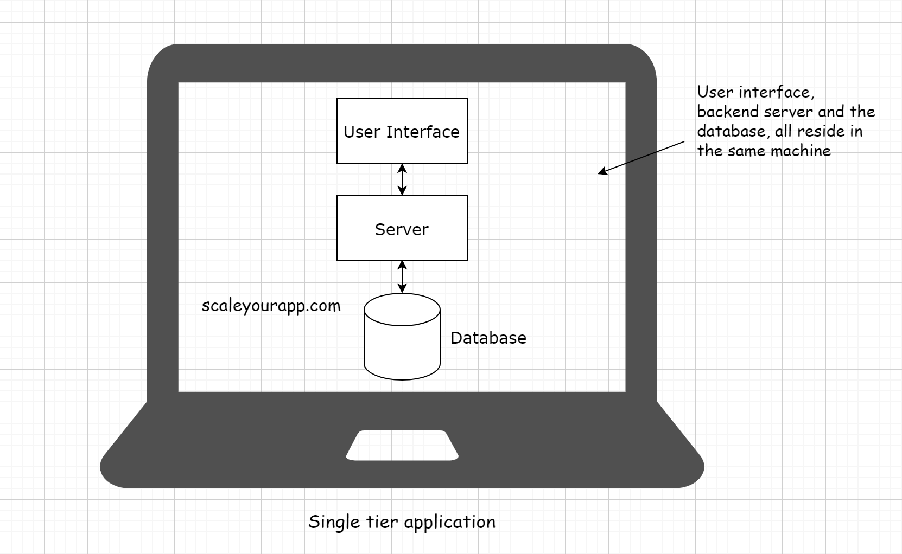

# Single Tier Application #
In a single-tier application, the user interface, backend business logic, and the database reside in the same machine.
Example: Desktop apps, PC Games etc.

## Upsides of Single Tier Applications ##
- Since all the layers resides in same machine, the performance of the application will be high (Actual Performance depends on how powerful the machine is and what is Application hardware requirements) 
and there will be no latency as the application don't need to communicate over network calls. 
- Since data is not being transmitted over network and resides in same machine, In a way the security will be of the highest order in single tier application.
- It is easy to test whole application at the same time with Single-Tier architecture and easy to manage, maintain as we have to manage only one machine.
- It is also cost-effective deployment wise.

## Downsides of Single Tier Applications ##
- There is problem of availability, since application is running on single machine/server, if machine goes down, application will not be available.
- There is problem of scalability as it is impossible to increase the specification of the machine after a certain level.
- One big downside of single-tier apps is that the application’s publisher has no control over the application. 
  Once the software is shipped, no code or feature updates can be made until the customer manually updates it by connecting 
  to the remote server or downloading and installing a patch(We see this in Desktop apps, PC Games etc.). Hence, there is very less/no 
  room for bugs, and it must be tested thoroughly.
- If no security is implemented, the application can be exploited by hackers and since it is single machine, they will be able to access
 all of your data. This might lead to data loss or data corruption if you don't have replica of your database.
- The code in single-tier applications is also vulnerable to being tweaked and reversed engineered. An evil person with some effort 
  can get access to the application’s source code, modifying or copying it for profit. This is unlikely in an architecture where the 
  company controls the application server and implements security to fend off the hackers.