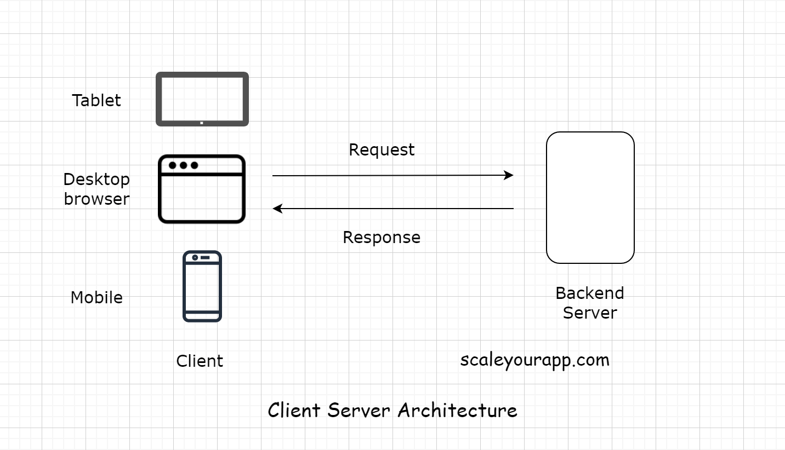

# Two Tier(Client-Server) Application #

A two-tier application involves a client and a server. The client contains the user interface with the business logic in
one machine. Meanwhile, the backend server includes the database running on a different machine. The database server is
hosted by the business and has control over it.

- The code in Tier-2 applications is still vulnerable but there are use cases where Tier-2 fits well like Productivity
  apps, To-do list, browser, mobile app games etc. Even though, someone might access your code, they won't make much
  harm to your business as the critical data resides in database and database (hosted in different machine).
- The mobile app game files are pretty heavy, and they get downloaded on the client only once when the user uses the
  application for the first time. And they make the network calls to the backend only to persist the game state.

## Upsides of Two Tier Applications ##

- Since UI and backend code is hosted in same machine, there will be minimal latency/network calls(network call when we
  call database server).
- Fewer servers meaning less cost for deployment, maintenance and services running.
- Since this contains static business rules it’s more applicable for homogenous environments

## Downsides of Two Tier Applications ##

- Since clients are directly interacting with the database, there is a risk of data being tweaked and loss(But it is
  more secure than Tier-1 as Database is being hosted in different machine).
- The biggest problem of two-tier applications is **Scalability**. As the number of users increases, and simultaneous
  client requests increases, application performance degrades rapidly due to the fact that clients necessitate separate
  connections and CPU memory to proceed
- Since client beholds most of the application logic, problems arise in controlling the software version and
  re-distributing of new versions
- Heterogeneous environments/Business environments with rapidly changing rules and regulations are not suitable since
  the database server has to handle the business logic which slows down database performance.
- Since the application logic is coupled with the client, it’s difficult to re-use logic dispersed among applications
  and tools.
- Most applications used for interaction is dependent on the database structure creating an issue when re-designing, as
  they are intimate with the prevailing structure of the database.