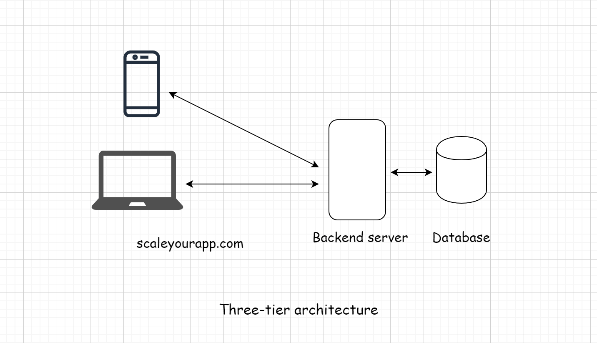

# Tier-3 Architecture #

In a three-tier application, the user interface, business logic, and the database all reside on different machines and,
thus, have different tiers. They are physically separated.

- Three-tier applications are pretty popular and largely used on the web. Almost all simple websites like blogs, news
  websites, etc., are part of this category.
- Let’s take the example of a simple blog. The user interface will be written using HTML, JavaScript, and CSS, the
  backend application logic will run on a server like Apache and the database will be MySQL. A three-tier architecture
  works best for simple use cases.

## Upsides of Two Three Applications ##

- Improved Scalability: Due to the distributed deployment of application servers, scalability of the system is enhanced
  since a separate connection from each client is not required whereas connections from few application servers are
  sufficient.
- Enhanced Re-usage: A similar logic can be sustained in many clients or applications. In appliance of object standards
  like COM/DCOM or CORBA, the language in the business-logic tier can be made transparent.
- Improved Data Integrity: Data corruption through client applications can be eliminated as the data passed in the
  middle tier for database updates ensures its validity.
- Enhanced Security: Through the implementation of several layers, enhances the data security on a service-by-service
  basis. As clients do not interact with the database directly, it provides less risk and conflict with unauthorized
  data. The placement of the business logic on a centralized server makes the data more secure.
- Reduced Distribution: The layered architecture enables to update only the application servers, not all distributed
  clients in case of a modification in the business logic.
- Redundant Sever Availability: mission-critical applications seek the use of superfluous application servers and
  database servers as its possible to create an application which will recover the system from network or server
  failures, with redundant servers.
- Hidden Database Structure: The actual structure of the database often remains hidden from requesters enabling any
  change of the database to be transparent. Thus, a process in the middle tier which exchanges data with other
  applications can sustain its current interface while a modification of the underlying database structure.

## Downsides of Two Tier Applications ##

- Complexity of Communication: Usually more effort should be enforced when creating 3-tier applications as the
  communication points are increased (client to middle tier to server, instead of directly client to server).
- Fewer Tools: Additional effort is required due to increase of performance whereas the 2-tier model can handle the
  particular function using an automated tool.